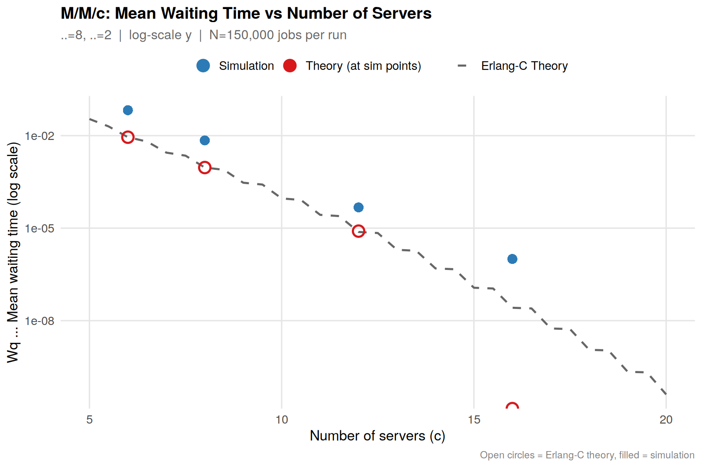
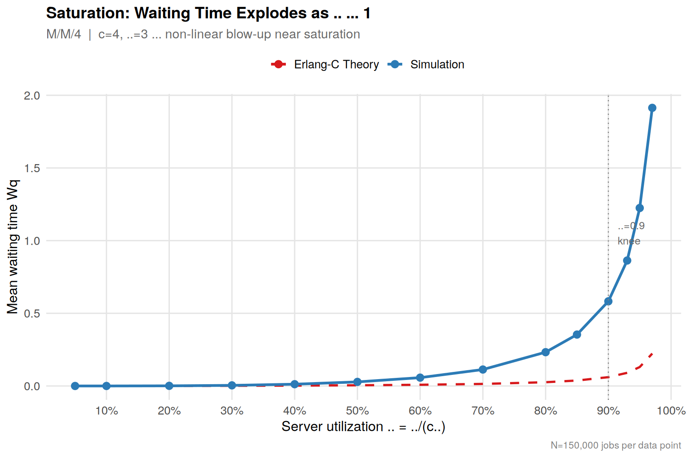
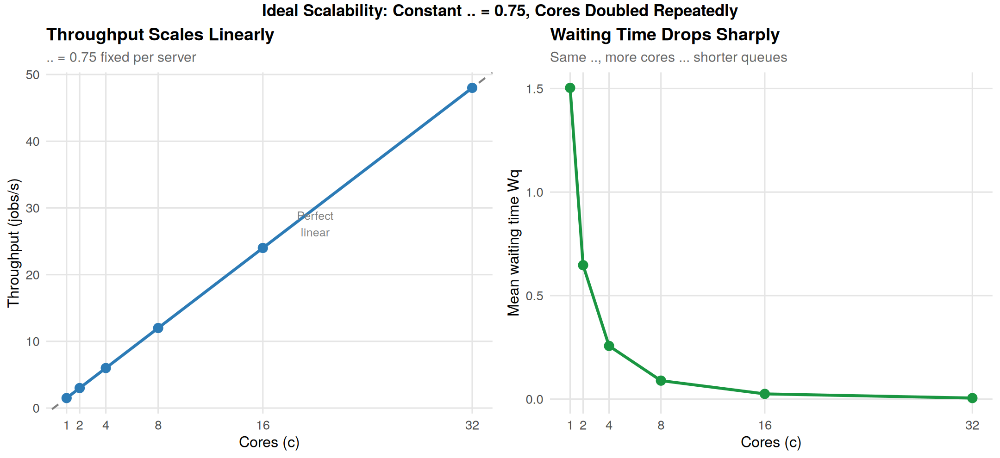
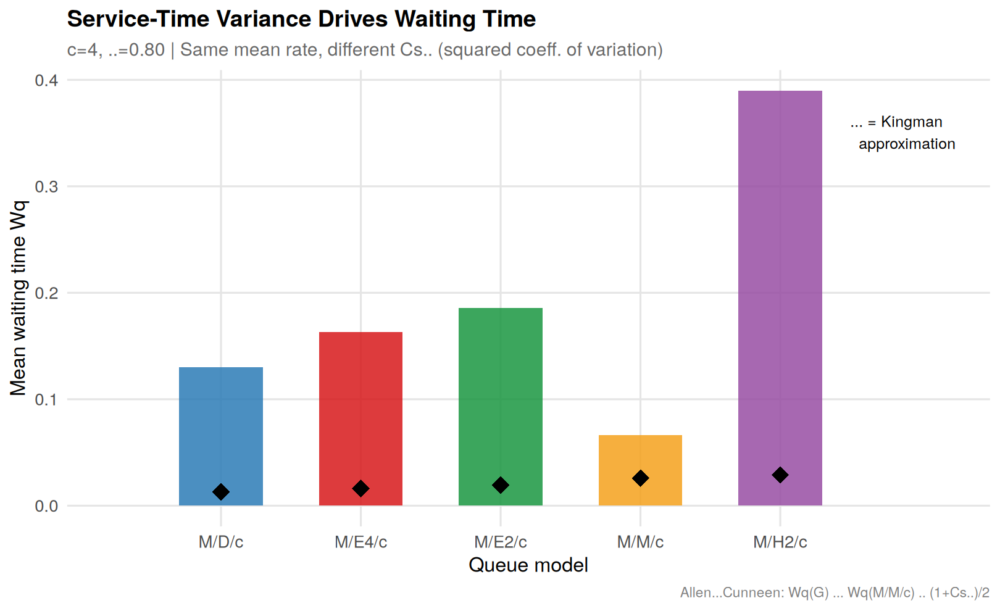
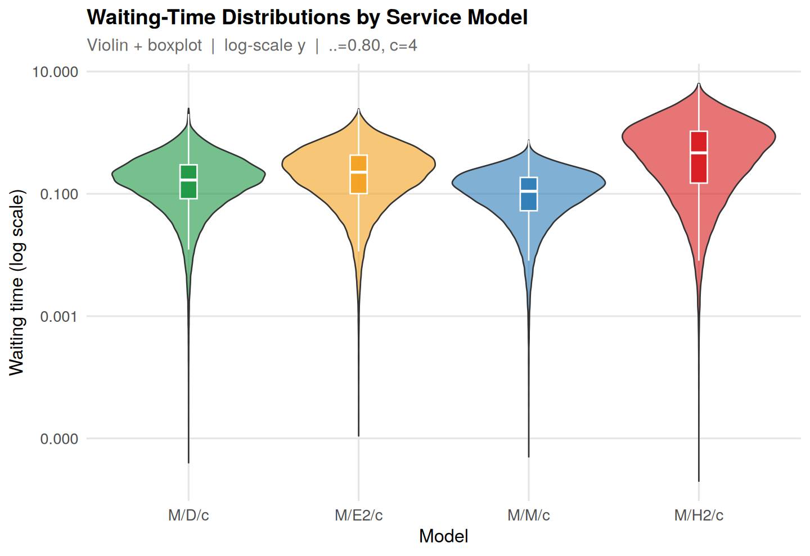
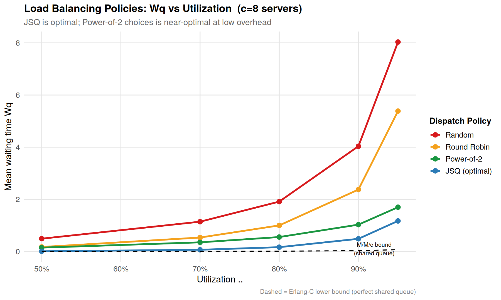
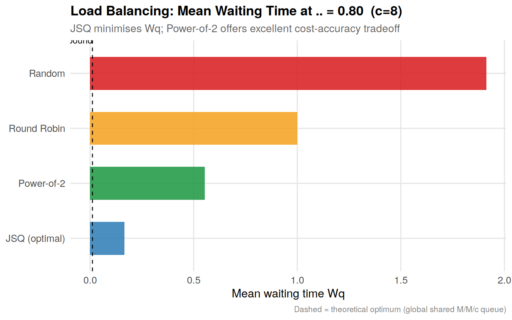
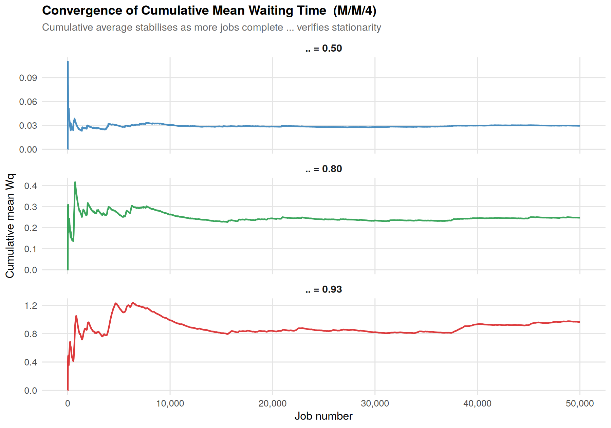
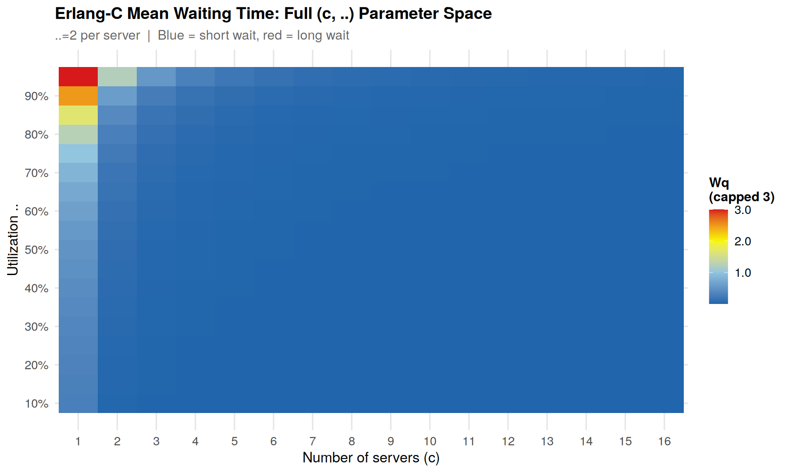

# Queueing Models for Parallel Computing Systems

A simulation and analysis project studying how classical queueing theory applies to multi-core and parallel computing environments. The simulation engine is written in **C++17** (event-driven, min-heap based) and all statistical analysis / visualisation is done in **R** using `ggplot2`.

📄 **Full report:** [`report/Report.pdf`](report/Report.pdf)

---

## Table of Contents

- [Overview](#overview)
- [Theory](#theory)
- [Project Structure](#project-structure)
- [Experiments & Results](#experiments--results)
- [Quick Start](#quick-start)
- [Engineering Takeaways](#engineering-takeaways)
- [References](#references)

---

## Overview

| Property | Value |
|---|---|
| Language (simulation) | C++17 |
| Language (analysis) | R 4.3 + ggplot2 |
| Simulation method | Discrete-Event Simulation (DES), min-heap event queue |
| RNG | Mersenne Twister (`mt19937_64`) |
| Jobs per run | 150,000 |
| Experiments | 5 |
| Output plots | 9 |

The project answers three core questions in parallel systems design:
1. **How many servers do I need?** (Experiments 1 & 3)
2. **What utilisation is safe?** (Experiment 2)
3. **Which dispatch policy should I use?** (Experiment 5)

---

## Theory

### M/M/c Queue

For `c` parallel servers, Poisson arrivals (rate λ), exponential service (rate μ per server):

```
ρ  = λ / (c·μ)                    # per-server utilisation (must be < 1)
Wq = C(c, a) / [c·μ·(1−ρ)·λ]      # mean waiting time (Erlang-C)
W  = Wq + 1/μ                     # mean sojourn time
Lq = λ·Wq        L = λ·W          # mean queue/system length (Little's Law)
```

where `C(c, a)` is the **Erlang-C** probability that an arriving job must wait, and `a = λ/μ` is the offered load.

### Allen–Cunneen Approximation (M/G/c)

For general service distributions with squared coefficient of variation Cs²:

```
Wq(M/G/c) ≈ Wq(M/M/c) × (1 + Cs²) / 2
```

| Distribution | Cs² | Interpretation |
|---|---|---|
| M/D/c (deterministic) | 0.0 | Wq ≈ Wq(M/M/c)/2 |
| M/E2/c (Erlang-2) | 0.5 | Moderate variance |
| M/M/c (exponential) | 1.0 | Reference |
| M/H2/c (hyper-exp) | >1.0 | Bursty service → higher Wq |

Full derivations and references are in [`report/Report.pdf`](report/Report.pdf).

---

## Project Structure

```
queueing-models-parallel-systems/
├── README.md
├── report/
│   └── Report.pdf            # Full write-up: theory, methodology, results, conclusions
├── include/
│   ├── queue_models.h        # Core types, M/M/c simulator, Erlang-C, RNG
│   └── csv_writer.h          # CSV export utilities
├── src/
│   ├── sim_mmc.cpp           # Experiments 1–3: servers, saturation, scalability
│   ├── sim_general.cpp       # Experiment 4: M/D/c, M/Ek/c, M/H2/c
│   └── sim_loadbalance.cpp   # Experiment 5: Random, Round Robin, Po2C, JSQ
├── R/
│   └── analysis.R            # All ggplot2 visualisations
└── results/
    ├── 01_server_scaling.png
    ├── 02_utilization_blowup.png
    ├── 03_scalability.png
    ├── 04_service_distributions.png
    ├── 04b_waiting_distributions.png
    ├── 05_load_balancing.png
    ├── 06_wq_heatmap.png
    ├── 07_convergence.png
    └── 08_policy_bar.png
```

> **Note:** raw simulation CSVs are not checked into this repo. Running the C++ binaries (see [Quick Start](#quick-start)) regenerates them locally before `analysis.R` is run.

---

## Experiments & Results

### Experiment 1 — Server Scaling (M/M/c)
**Setup:** λ=8, μ=2, c ∈ {6, 8, 12, 16}
**Question:** How does adding servers reduce waiting time?



**Result:** Wq drops by ~1,400× when c increases from 6 to 12. Simulation tracks Erlang-C theory across five orders of magnitude.

---

### Experiment 2 — Utilisation Saturation (M/M/4)
**Setup:** c=4, μ=3, ρ swept from 5% to 97%
**Question:** At what utilisation does the system saturate?



**Result:** Non-linear blow-up beyond ρ ≈ 0.85; Wq at ρ=0.97 is 8× higher than at ρ=0.90. Systems should be provisioned below ρ = 0.80 for latency headroom.

---

### Experiment 3 — Scalability
**Setup:** ρ=0.75 fixed, c doubled from 1 to 32 (λ scaled proportionally)
**Question:** Does throughput scale linearly with cores?



**Result:** Throughput scales perfectly linearly with cores; Wq simultaneously drops ~300× (1.50s → 0.005s) due to pooling efficiency at scale.

---

### Experiment 4 — Service Distributions (M/G/4)
**Setup:** c=4, ρ=0.80; compare M/D/c, M/E2/c, M/E4/c, M/M/c, M/H2/c
**Question:** How much does service-time variance matter?




**Result:** M/H2/c (bursty, Cs²≈2.5) has ~6× higher Wq than M/D/c (deterministic) at the same mean service rate — variance matters as much as mean.

---

### Experiment 5 — Load Balancing Policies
**Setup:** c=8, μ=2, ρ ∈ {0.5, 0.7, 0.8, 0.9, 0.95}; compare Random, Round Robin, Po2C, JSQ
**Question:** Which dispatch policy minimises waiting time?




**Result at ρ=0.95:** Random=8.03s, Round Robin=5.38s, Po2C=1.70s, JSQ=1.17s. Power-of-Two Choices achieves near-JSQ performance at O(1) cost, confirming the classical "power of two choices" result.

---

### Convergence Verification



Cumulative mean waiting time stabilises within 20,000–50,000 jobs across all utilisation levels, confirming N=150,000 jobs is sufficient for stable estimates.

---

### Parameter Space Heatmap



Erlang-C Wq across the full (c, ρ) space — a quick lookup table for capacity planning. To keep Wq < 0.1s at ρ=0.80 requires at least c=6 servers; at ρ=0.90, even c=16 is insufficient.

---

## Quick Start

### Prerequisites

```bash
# C++ compiler (GCC ≥ 9 or Clang ≥ 10)
g++ --version

# R ≥ 4.0
R --version

# R packages
Rscript -e "install.packages(c('ggplot2','dplyr','tidyr','scales','gridExtra'))"
```

### 1. Compile & Run Simulations

```bash
cd src/

g++ -O2 -std=c++17 -I../include sim_mmc.cpp        -o sim_mmc
g++ -O2 -std=c++17 -I../include sim_general.cpp    -o sim_general
g++ -O2 -std=c++17 -I../include sim_loadbalance.cpp -o sim_loadbalance

./sim_mmc          # writes CSVs to ../data/ (exp1–exp3)
./sim_general      # writes CSVs to ../data/ (exp4)
./sim_loadbalance  # writes CSVs to ../data/ (exp5)
```

Expected runtime: ~30–60 seconds total (150k jobs × 3 simulators). The `data/` directory is created automatically if it doesn't exist.

### 2. Generate Plots

```bash
cd R/
Rscript analysis.R
# Plots saved to ../results/
```

### 3. Read the Report

Open [`report/Report.pdf`](report/Report.pdf) for the complete write-up including theory derivations, methodology, full results tables, and engineering recommendations.

---

## Engineering Takeaways

| Rule | Recommendation |
|---|---|
| Utilisation cap | Keep ρ ≤ 0.80 for latency-sensitive services |
| Server count | Prefer 2× servers at 50% each over 1 at 100% |
| Dispatch policy | Use Power-of-Two Choices; avoid random dispatch |
| Service variance | Reduce job variance via batching/admission control |
| Scalability | Horizontal scaling is linear at constant per-server ρ |
| SLA headroom | Budget at least 15% headroom above peak load |

---

## References

1. Gross, Shortle, Thompson, Harris (2008). *Fundamentals of Queueing Theory*, 4th ed. Wiley.
2. Kleinrock, L. (1975). *Queueing Systems, Vol. 1: Theory*. Wiley.
3. Mitzenmacher, M. (2001). The Power of Two Choices in Randomized Load Balancing. *IEEE Trans. Parallel Distrib. Syst.* 12(10).
4. Allen, A. O. (1990). *Probability, Statistics and Queueing Theory*, 2nd ed. Academic Press.
5. Law, A. M. (2007). *Simulation Modeling and Analysis*, 4th ed. McGraw-Hill.

---

*Built with C++17 event-driven simulation and R/ggplot2 analysis.*
